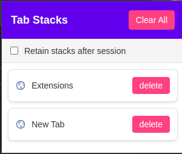

# Tab-Stack-Manager

## Description 
**Tab Stack Manager** is a lightweight chrome extension designed to help you organize your browser tabs into beautiful, manageable stacks, Whether you are juggling multiple  project, researching , or just surfing,  this extension ensures your tabs are always organized and accessible without clutter.

With this extension, you can: 
- **Save Tabs for later**: Store websites you want to visit later without bookmarking them.
- **Retain tabs across sessions**: Choose whether to keep your stacks after closing your browser.
- ** lightweight**: Enjoy a minimalistic design with no impact on your browser's performance.

---
## Features
- **Tab Stacking**: Group tabs into beautiful, customizable stacks.
- **Save for Later**: Store websites you want to revisit without bookmarking them.
- **Session Retention**: Choose whether to retain stacks after closing your browser.
- **Lightweight**: Minimal impact on browser performance.
- **User-Friendly Interface**: Simple and intuitive design for seamless use.
---

## The Problem it solves
Problem: Too many open tabs clutter your browser, slow it down, and make it hard to find what you need. Bookmarking feels too permanent, and losing tabs when you close your browser is frustrating.

Solution: Tab Stack Manager lets you organize tabs into stacks, save them for later without bookmarking, and choose whether to keep them after closing your browser. It’s lightweight, fast, and perfect for decluttering while keeping your browsing smooth and organized.

Unique: Unlike bookmarking or heavy tab managers, it’s simple, flexible, and designed for temporary tab storage without slowing you down.


## Installation
1. **Download the extension**:
   - Clone this repository using the following command 
   ``` git clone https://github.com/GamerBoi801/Tab-Stack-Manager.git ```
   or download the `.zip` file.

2. **Load the extension in Chrome**:
   - Open Chrome and go to `chrome://extensions/`.
   - Enable **Developer mode** in the top right corner.
   - Click **Load unpacked** and select the extension folder.
3. **Pin the extension**:
   - Click the puzzle icon in the top-right corner of Chrome.
   - Pin **Tab Stack Manager** to your toolbar for easy access.

---

## Usage



## Feedback
If you have any feedback or suggestions, feel free to open an issue or reach out to us. We’d love to hear from you!